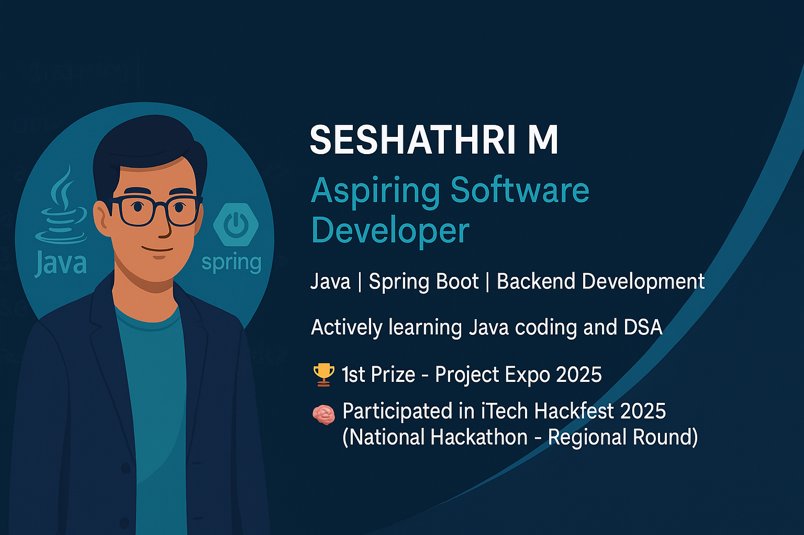

<div align="center">

# 👋 Hi, I'm Seshathri M



### 🚀 Aspiring Software Engineer | Backend Developer | Problem Solver

[](http://linkedin.com/in/seshathri-m)
[](https://github.com/seshathri044)
[](mailto:mseshathri507@gmail.com)

</div>

---

## 💫 About Me

```java
public class Seshathri {
    private String role = "Student";
    private String[] focus = {"Software Development", "Java", "Spring Boot"};
    private String education = "B.E. CSE @ Anna University";
    private String college = "Mangayarkarasi College of Engineering";
    
    public String currentlyLearning() {
        return "Building scalable backend systems with Spring Boot & exploring DSA";
    }
    
    public String[] interests() {
        return new String[]{"Web Development", "Backend Development", "System Design"};
    }
}
```

<div align="center">

### 🎯 Quick Stats


</div>

---

## 🛠️ Tech Stack & Skills

<div align="center">

### Languages


### Frameworks & Technologies


### Developer Tools


### Design Tools


### Core Competencies


</div>

---

## 🌱 Currently Learning

<table>
<tr>
<td width="50%">

### Backend Development
- 🔥 Spring Boot & Microservices
- 🔐 JWT Authentication & Security
- 🗄️ Database Design & Optimization
- 🌐 RESTful API Development

</td>
<td width="50%">

### Problem Solving
- 📊 Data Structures & Algorithms
- 💡 Competitive Programming
- 🧩 System Design Fundamentals
- ⚡ Performance Optimization

</td>
</tr>
</table>

---

## 🚀 Featured Projects

### 💰 [ExpenseTracker Backend](https://github.com/seshathri044/expense-tracker-backend)
**A production-ready Spring Boot REST API for personal finance management**

- 🔐 JWT-based authentication & authorization
- 💵 Complete expense & income tracking system
- 📊 Real-time financial analytics & statistics
- 🗄️ MySQL database with Hibernate ORM
- ⚡ RESTful API with pagination & filtering

**Tech Stack:** `Spring Boot` `Spring Security` `MySQL` `JWT` `Hibernate` `Maven`

---

### 🎯 [Gender and Age Detection Using OpenCV](https://github.com/seshathri044/age-and-gender-detection)
**Real-time human age and gender detection using machine learning**

- 🤖 Deep learning with pre-trained CNN models
- 📷 Real-time webcam & image processing
- 🎯 High accuracy gender classification
- 👤 Age prediction with confidence ranges
- 💻 Built with OpenCV & Python

**Tech Stack:** `Python` `OpenCV` `Deep Learning` `Computer Vision`

**Key Features:**
- Multi-face detection capability
- Easy-to-use interface

---

### ⚡Other Mini Projects Are:
- 📱 **Course Registration System** - Java application
- 🏦 **Student Management System** - Flutter application
- 🛒 **E-Commerce Flutter** - Flutter application

---

### 🔜 More Projects Coming Soon...
Currently working on:
- Full stack Expense Tracker Application

---

## 🏆 Achievements & Recognition

<div align="center">

| Achievement | Event | Year |
|------------|-------|------|
| 🥇 **1st Prize** | Project Expo - College Level | 2025 |
| 🚀 **Participated Regional Round** | iTech Hackfest - National Hackathon | 2025 |
| 💡 **Active Contributor** | Open Source Projects | Ongoing |

</div>

---

## 📊 GitHub Activity

<div align="center">


</div>

---

## 💼 What I'm Looking For

- 🎯 **Job Opportunities** in Software Development
- 🤝 **Open Source Collaborations** on Java/Spring Boot projects
- 📚 **Learning Opportunities** to work with experienced developers
- 💡 **Challenging Projects** that push my technical boundaries

---

## 📫 Let's Connect!

<div align="center">

I'm always excited to collaborate on interesting projects or discuss technology!

[](http://linkedin.com/in/seshathri-m)
[](https://github.com/seshathri044)
[](mailto:mseshathri507@gmail.com)

</div>

---

## 💭 My Coding Philosophy

> "Clean code is not written by following a set of rules. You don't become a software craftsman by learning a list of what to do and what not to do. Professionalism and craftsmanship come from values that drive disciplines." - Robert C. Martin

---

<div align="center">

### 📈 Profile Views


### ⭐ Show some love by starring my repositories!

**Every commit is a small step toward clarity or chaos — choose clarity**

---
Made with ❤️ by Seshathri M | Last Updated: October 2025

</div>
